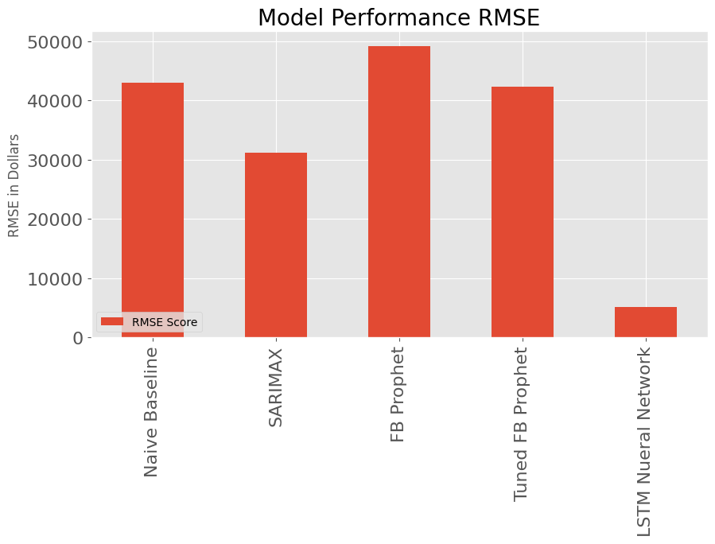
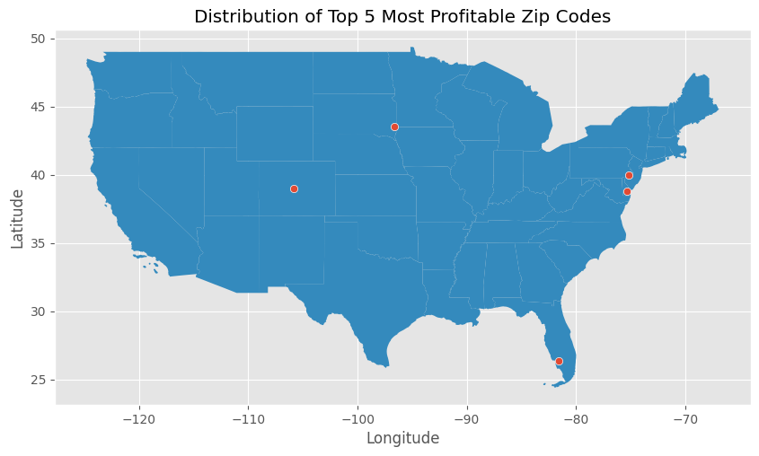

# Compass Real Estate Time Series Modeling

Author: Emily Marsh

## Introduction

In the United States, a common opportunity for personal and commercial investment is real estate. In 2023, the average annual return on investment for residential real estate in the United States is 10.6 percent. Commercial real estate has a slightly lower average ROI of 9.5 percent, while REITs average slightly higher at 11.8 percent. There have been recent historical events that have had an impact on this annual return on investment. The housing crash in 2008 as well as the COVID pandemic of 2020 have had outsized impacts on the pricing of housing. However an overall increase has made this an area of consistent profit. Compass Real Estate, a real estate brokerage company that specializes in high-margin, luxury homes in upscale markets, has commissioned this project team to expand into a new lower cost housing market in order to appeal to a broader group of clients and lower initial investment.

## Business Objective

Compass Real Estate is interested in investing in lower priced housing, under $300,000, for a smaller but more consistent revenue stream to supplement their luxury housing investments. This will also give the company the chance to expand their client base to more middle class home buyers. However, before investing capitol in this new venture, Compass has comissioned this project team to analyze and build a time series model to determine the most profitable top five zipcodes. Using the dataset, this project will provide insight into the five top zip codes for investment as well as the future projected profits over the next two years. These predictions will be made using a time series model.

## Dataset

The dataset used for this project is a subset of a larger dataset from Zillow, and consists of 14,732 rows and 272 columns. The format of the dataset includes the features RegionID, Region Name (Zipcode), City, State, Metro, County Name, Size Rank, and the average price of houses in the zipcode starting in April of 1994 and ending with April of 2018. Each RegionName/Zipcode is a unique value, while Metro and County Name are not. It is also important to note that the dataset is in a wide format versus a long format. Therefore in order to pass this data into a model, the dataset will need to be reshaped to a long format.

## Data Preparation

A dataset with 14723 rows would require substantial processing power to run through a model. Therefore in order to streamline the process, the dataset will be filtered using the client's budget and the zipcodes that show the greatest return on investment as of April 2018. In order to determine this, the profit of each zip code will be subtracted from the original price of the average property in April of 1996 from the average property value in April of 2018. Due to the client's budget, the available houses will be limited by price, only properties with a value of under $300,000 as of April 2018. Since Compass is a national company, geography is not a limiting factor for investment consideration therefore no geographical constraints will be used to limit the available zipcodes.

## Methods

In order to determine which time series model is appropriate for the data series, four models will be built. Once built, the most accurate time series model will be selected to fine tune and make predictions for final recommendations. The RMSE score will be used as a determinate of which model is the most accurate. The reason the RMSE will be used is that, as an expression of how closely the data points are around the line of best fit, the highest RMSE score shows the most accurate prediction and limits the amount of unpredicted values. This is important since the client wants to as accurately as possible predict future ROI on investment.

## Visualizing Time Series Model Performance

Compared to the RMSE values of previous models, the LSTM Neural Network vastly improved upon the accuracy of previous predictions. Since the LSTM is a recurrent neural network, having feedback connections versus a standard feedforward neural network had a positive impact on the accuracy of predictions. Based on this RMSE evaluation, the LSTM Neural Network model will the be the final model used for prediction on all of the top 25 zipcodes.

* The RMSE value associated with the **base model is $42,967.06724835346**
* The RMSE value associated with the **AUTO ARIMA model is $31,204.69249024491**
* The RMSE value associated with the **Facebook Prophet model is $49,199.202762526045**
* The RMSE value associated with the **Tuned Facebook Prophet model is $42,310.49083950662**
* The RMSE value associated with the **LSTM Neural Network model is $4,331.569679943821**

## Conclusions

Compass Real Estate has a final model for prediction with an **RMSE score of $4,331.57**. This model was used to make predictions on the top 25 zipcodes with average property values under $300,000 in order to make a recommendation of five zipcodes for investment.

The five zipcodes, as determined by the final model, were **80449, 57110, 19125, 19968, and 34120**.

The Final Model was developed by building a **LSTM Neural Network Model which had an RMSE score of 4331.57**. According to the Final Model, the following **five zipcodes had the higest return on investment from April 2018 to April of 2020**.

* **Zipcode 80449 in Central Colorado with a growth of 2.97%**
* **Zipcode 57110 in South Dakota with a growth of 2.49%**
* **Zipcode 19125 in Pennsylvania with a growth of 2.17%**
* **Zipcode 19968 in Delaware with a growth of 1.9%**
* **Zipcode 34120 in Florida with a growth of .95%**

## Recommendations

Now that a model has been created that can predict with reasonable accuracy zipcodes that will experience the greatest growth in price, this model can be used to select five zipcodes for initial investment with the greates potential ROI. **It is recommended that Compass Real Estate make property investments in the following zipcodes**:

*   **80449**
*   **57110**
*   **19125**
*   **19968**
*   **34120**

These five zipcodes, according to the final model, will experience **the largest amount of growth over the next two years**. 

## Next Steps

To continue towards the goal of a higly predictive model, Compass Real Estate could follow tehes additional suggetions:

1.   **Include current pricing for more up to date predictions**
2.   **Conduct additional research into feature importance of zipcodes for impact on growth**
3.   **Additional exploration into optimized parameters for the LSTM Neural Network model to increase RMSE scores**

## References

*   https://machinelearningmastery.com/time-series-prediction-lstm-recurrent-neural-networks-python-keras/
*   https://machinelearningmastery.com/how-to-develop-lstm-models-for-time-series-forecasting/
*   https://www.unitedstateszipcodes.org/

## For More Information

The full analysis and process by which these conclusions were reached can be found in the Jupyter notebook or by reviewing the summary presentation.

For additional questions, contact Emily Marsh: marshemily2@gmail.com

## Repository Structure

|── Data
 
 ├── Images
 
 ├── README.md
 
 ├── PhaseFourFinalProjectPresentation.pdf
 
 └── PhaseFourProject.ipynb
